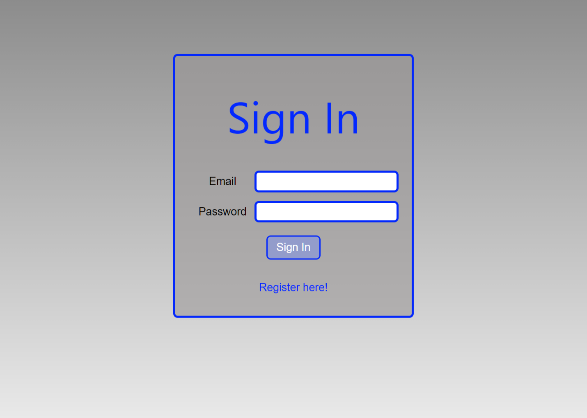
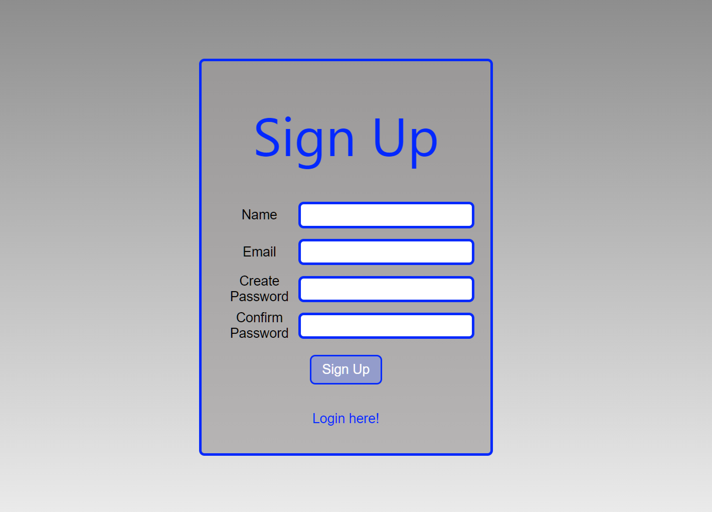
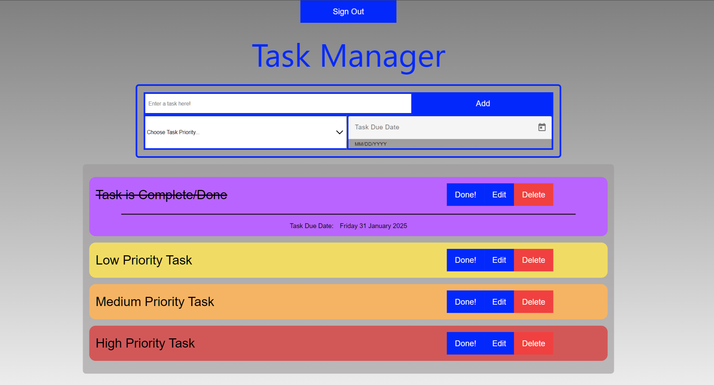
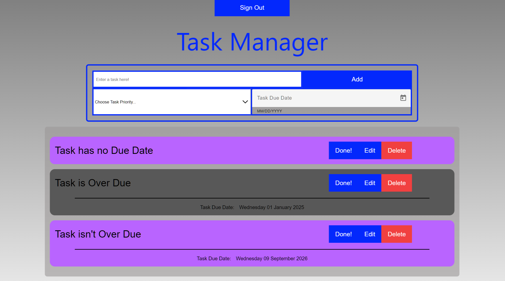

# [Tasks Manager](https://tshepomasuku.github.io/TasksManager/)

## Table of Contents

- [Tasks Manager](#tasks-manager)
  - [Table of Contents](#table-of-contents)
  - [Introduction](#introduction)
  - [Features](#features)
  - [Screenshoots](#screenshoots)
    - [Signin Screen](#signin-screen)
    - [Signup Screen](#signup-screen)
    - [Home Screen: Screenshoot Showing Task Priority Features](#home-screen-screenshoot-showing-task-priority-features)
    - [Home Screen: Screenshoot Showing Due Date Features](#home-screen-screenshoot-showing-due-date-features)

## Introduction

This is a To Do List App with some basic functionalities called Task Manager built using [Angular 18](https://github.com/angular/angular-cli).

## Features

- Signin functionality
- Signup functionality
- Add a new Task(To Do List entry) and, Optionally choose the Task's Priority and Due Date
- Update Task(To Do List entry) details
- Remove Task(To Do List entry) details

## Screenshoots

### Signin Screen

### Signup Screen

### Home Screen: Screenshoot Showing Task Priority Features

### Home Screen: Screenshoot Showing Due Date Features

